# Deploying LAMP stack using vagrant VMs

## Setup machines in [Vagrantfile](/Vagrantfile)
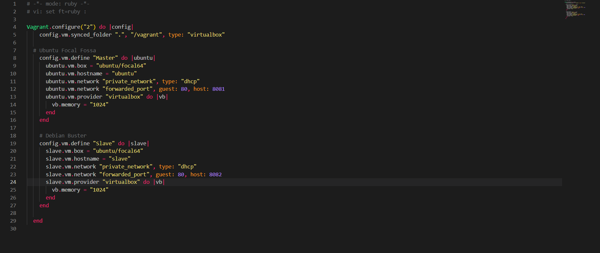

## Provision VMs

`vagrant up`
 
## Check status and ssh into master

`vagrant status`

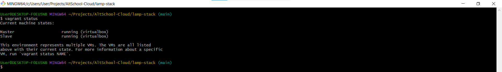

## Get machines IP addresses

`ip addr`

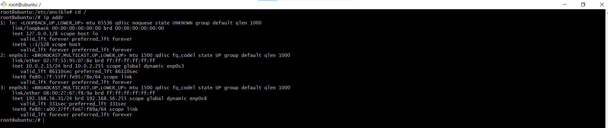
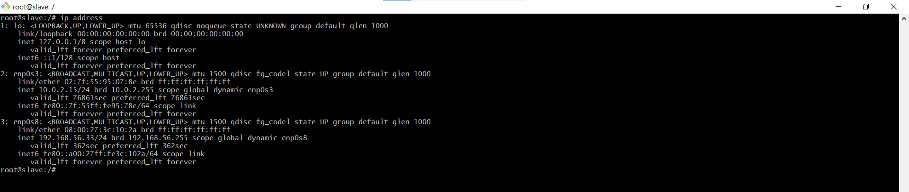

```
Master: 192.168.56.31
Slave: 192.168.56.33
```

## Generate ssh key for master and copy to slave

`ssh-keygen`

`ssh-copy-id root@192.168.56.33`

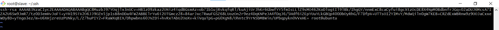


## Install ansible on master, setup [hosts](/hosts) file and test connection

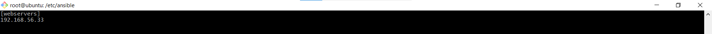

`ansible all -m ping`

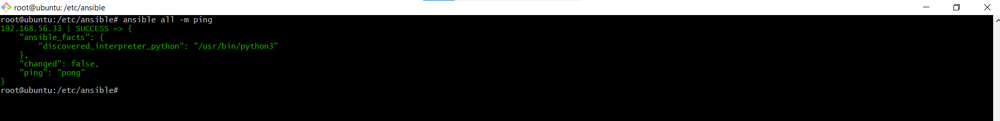

## Create [Ansible Playbook](/run_deploy_script.yml)

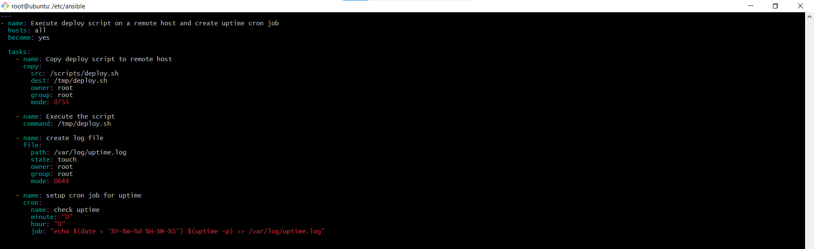

## Run [Deployment Bashscript](/deploy.sh) 


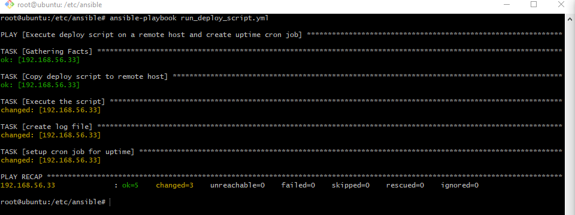


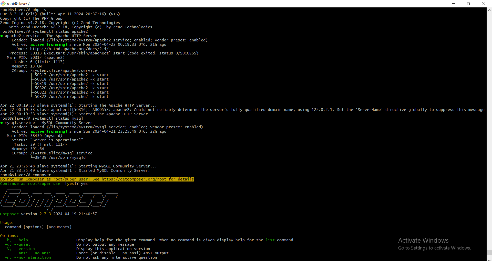


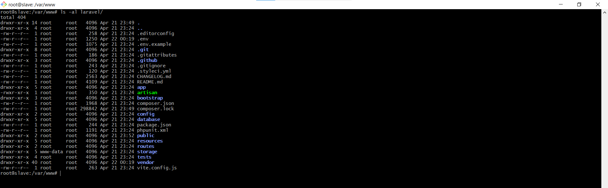


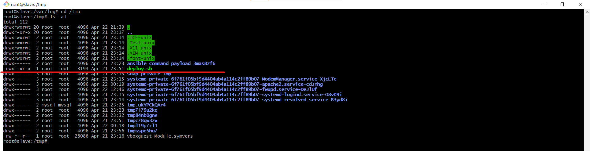


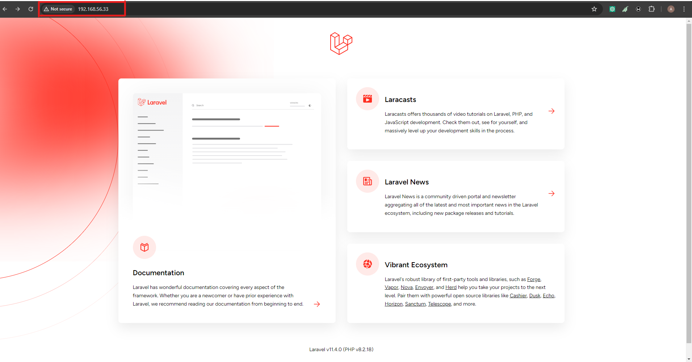


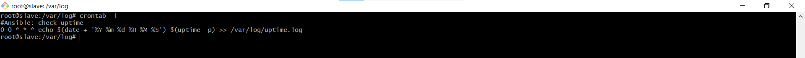


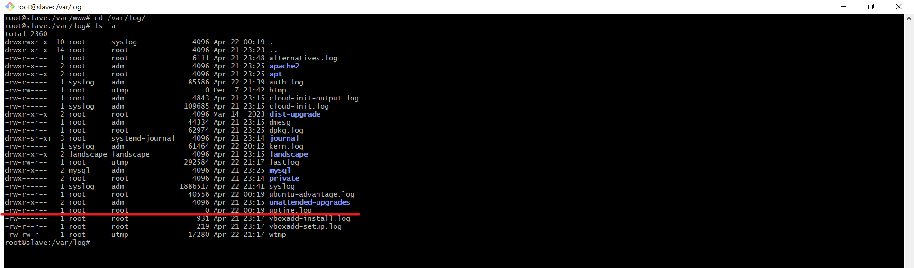


